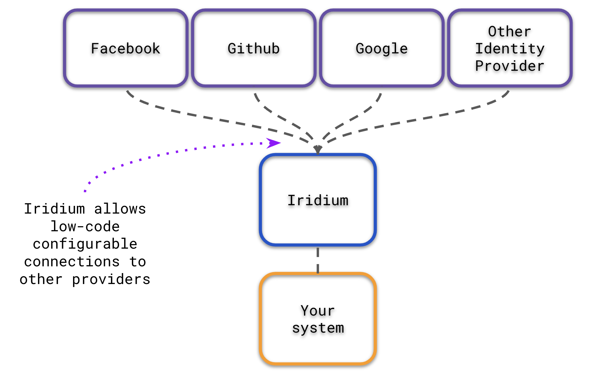

# Iridium

# [Try Iridium for free](https://www.iridium.software)

## What is iridium?
Iridium is an OAuth2.x-compliant customer identity and access management (CIAM) system.  It allows developers to integrate
3rd party social login providers into their own systems in a low-code manner.  

## What is a social login provider?
Using a 3rd party authorization services like Github, Google, Twitter, Microsoft etc. 

## Why is this important

Iridium helps developers improve the customer experience by providing a seamless and customizable log in experience with a low-code approach.
With Iridium, you can reduce development time and streamline product development. 

## Welcoming Community
We are just getting started!
* We are welcoming, inclusive, and friendly
* Iridium is 100% free and open source. We encourage and support an active, healthy community that accepts contributions from the public – including you!
* Our end goal isn't to hang on to Iridium.  Once we get the project and community built up enough, we'd like to donate the
  the project to a larger managing organization. Help us get there.
* We need your help, this project is early in terms of open source releases, we need as many eyes on it as we can.
* [Participate in discussions on Github](https://github.com/IridiumIdentity/iridium/discussions)

## Why build Iridium?

We've used other closed-source providers and found that the biggest issue when things go wrong is
the options for support are minimal, communities don't exist, and because of this people are often left making best guesses
on how to implement authentication or authorization into their system. 
Iridium is here to give you a path forward in managing your customers seamless log in experience.

## How can I contribute?
There are many places to start.  You can start with documentation, fixing bugs related to issues, helping with building examples, etc.

We are looking forward to you telling us how we can make the project better.

Check out [CONTRIBUTING](./CONTRIBUTING.md) for more details.

