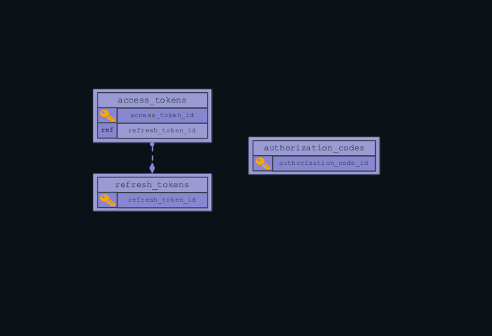
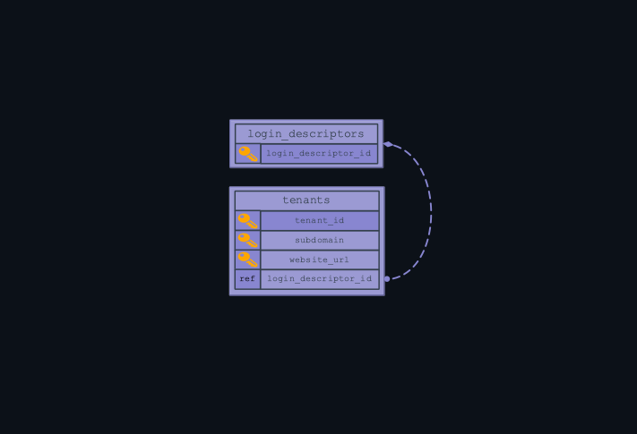

# Iridium Database

The Iridium database stores the data and metadata for an Iridium instance. Each Iridium instance uses its own database, which is hosted in a separate container to the primary application. The database can be treated as a simple repository rather than an independent data management system.

In this document, the physical structure of the database will be laid out for both cursory reference and as a rough guide for developers aiming to reconfigure the system.

## Abstract Overview

Figure 1: Abstract iridium database breakdown. 

Iridium uses a fairly linear data flow between its entities to achieve tasks. A third party `external identity provider` such as google or github is linked to an `application` secured with Iridium. Within a `tenant` container, `identities` of users are verified using Iridium. Within each `tenant` are `customer identities` (end-users) and `managing identities` (tenant-level system administrators).

* **Managing Identity:** System administrators for a tenant. There can be multiple managing identities per tenant.
* **Customer Identity:** Standard user of Iridium. At the level of tenant, each user is limited to one identity. However, users can make an identity for an unlimited number of tenants.
* **Tenant:** A tenant is a container for clients, representing an environment or organization. A single company using Iridium can register multiple tenants.
* **Application:** Applications are the specific apps secured with Iridium. They are bound to a tenant.
* **Application Type:** The types of applications securable by Iridium. Currently, this range is limited to a single page application such as Angular.
* **External Identity Provider:** Third party identity providers using Iridium to authenticate user credentials and gate access for users. Other Iridium instances can be external identity providers.

## System Breakdown
 The default Iridium database does contain constrained relationships, but is primarily controlled through the java application. 

 Developers who prefer using a relational database management system such as MariaDB to control data flow can still configure Iridium to their needs. Iridium is made to be manipulated and retooled to meet different developer's needs and standards.

*A Note on Reading the Diagrams*

Some entities reference a key attribute from another entity without using it as an identifying key. Such attributes will be marked "ref." Real database entities directly correlating to roles in the abstract data flow will be `highlighted`. 

---
### Resource Access Entities

figure 2: Resource Access Entity Relationship Diagram

Data Iridium uses to allow access to protected resources.

* **[refresh_tokens]:** Allows access tokens to be used again.
* **[access_tokens]:** Holds the hashes that allow access to protected resources.
* **[authorization_codes]:** Codes exchanged between client and Iridium, used by the client to request access and refresh tokens.

---
### Tenants

figure 3: Tenant Entity Relationship Diagram

A tenant is a container for clients, representing an environment or organization. A single company using Iridium can register multiple tenants.

* **[login_descriptors]:** Describes what the login page holds for each tenant.
* **`[tenants]:`** Stores defining data for a tenant container. Tenant names are used in the tenant's login URL, so tenant names in the database must be URL safe.
---
### External Identity Providers
![This is an External Identity Provider Entity Relationship Diagram. Four entities are present, three of which are defined in the list below, one of which is defined in the tenants section. The relationships are as follows: external_identity_provider_parameter_templates has a many relationship with external_identity_provider_templates. external_identity_providers has a many relationship with external_identity_provider_templates. external_identity_providers also has a many relationship with tenants.](../images/iridiumdb-external-identity-providers.png)

figure 4: External Identity Provider Entity Relationship Diagram

Entities holding configuration for external identity providers (google, github, facebook, etc) authenticating using Iridium. Other Iridium instances are registerable as external identity providers.

* **[external_identity_provider_templates]:** Templates for potential external identity providers.
* **[external_identity_provider_parameter_templates]:** Prebuilt parameter configurations for adding to an external identity provider.
* **`[external_identity_providers]:`** Holds the seed data for an OpenID provider to authenticate with Iridium.
---
### External Identity Provider Workspace
![This is an External Identity Provider Workspace Entity Relationship Diagram. There are five entities, four of which are defined below, and one of which was previously defined in the external identity providers section. The relationships are as follows: external_identity_providers defines access_token_parameters and authorization_parameters, one provider to many definitions. external_identity_provider_parameters has a many relationship with external_identity_providers. in_progress_external_identity_provider_authorizations has a many, optional relationship with external_identity_providers.](../images/iridiumdb-exidpr-workspace.png)

figure 5:External Identity Provider Workspace Entity Relationship Diagram

Entities containing additional configuration and dynamic functions for an external identity provider.

* **[access_token_parameters]:** Configuration for access tokens specific to an external identity provider.
* **[authorization_parameters]:** Configuration for authorization codes, specific to an external identity provider.
* **[external_identity_provider_parameters]:** Additional configuration for a specific external identity provider.
* **[in_progress_external_identity_provider_authorizations]:** Container for the dynamic function of authorizing with an external identity provider.
---
### Identities

figure 6:Identities Entity Relationship Diagram

Client authenticating with an external identity provider via Iridium. A single client may have multiple identities for different external identity providers.

* **[profiles]:** Holds basic client registration data.
* **`[identities]:`** Clients registered with a specific external identity provider, contains both managing and customer identities.
* **[tenants_identities_xref]:** tenants/identities cross-reference.
---
### Identity Workspace
![This is an Identities Workspace Entity Relationship Diagram. Eight entities are in the diagram, seven of which are defined below, and one of which was previously defined in identities. The relationships are as follows: identities has a single-to-many relationship with identity_email_addresses, authentications, and identity_property. Email_verification_tokens has a many, optional relationship with single identity_email_addresses. Many roles_identities_xref are defined by single identities and roles.](../images/iridiumdb-id-workspace.png)

figure 7:Identities Workspace Entity Relationship Diagram

Additional configuration entities and containers for dynamic functions related to identities.

* **[identity_create_session_details]:** Metadata storage for a single instance of registering an identity.
* **[authentications]:** active authorizations/codes/etc for user
* [**identity_property]:** additional configuration for a specific user.
* **[identity_email_addresses]:** emails associated with a user.
* **[email_verification_tokens]:** verification for registered user emails.
* **`[roles]:`** User roles, contains delineations between managing and customer identities.
* **[roles_identities_xref]:** roles/identities cross-reference.
---
### Applications

figure 8:Applications Entity Relationship Diagram 

Applications are the specific apps secured with Iridium. They are bound to a tenant.

* **[application_types]:** All types of applications securable via Iridium
* **`[applications]:`** Applications secured with Iridium. Applications are specific to a tenant.
* **[client_secrets]:** client secret codes associated with an application
* **[scopes]:** access parameters for an identity particular to an application
* **[identities_applications]:** identities/applications cross-reference.
