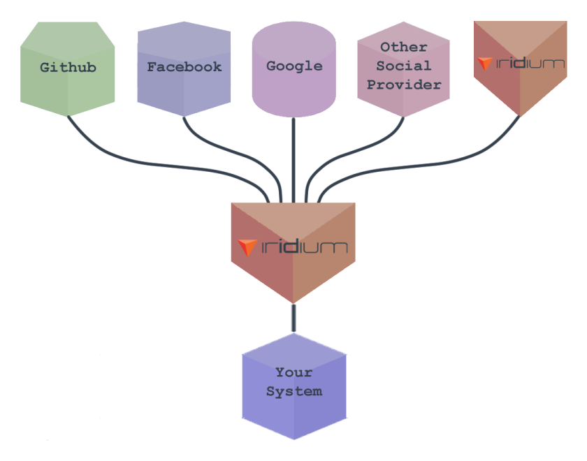

# What is iridium?
Iridium is an OAuth 2.x-compliant customer identity and access management (CIAM) system designed for accessibility and configurability.
Iridium integrates into any 3rd party management system with minimal code.

### [Try it for free.](https://conduct.iridium.software/)

## Why use Iridium?
Iridium is an opinionated, scalable implementation for securing any system of any size. It comes with community support and ease of use built in.

The OAuth 2.x specification leaves many details undefined. These details include security, authentication, and authorization. These omissions are deliberate, but they leave developers making best guesses at implementing sensitive processes.

 Iridium takes pressure off developers securing their applications and databases. Iridium is highly configurable and requires minimal technical knowledge to set up its basic features. As an open source project, Iridium can respond to the needs of its users by contributions from the users themselves.

## What does Iridium do?
In the OAuth 2.x framework, Iridium plays the role of an authorization server. Iridium's roles include authenticating user credentials, verifying redirect URIs match, and managing access/refresh tokens. The diagram below shows a simplified outline of the process.

### Legend

 *  **Resource owner:** Entity capable of granting access to a protected resource, often an end-user of an application.
 * **User-agent:** Software for recieving, sending, and processing web content, such as a web browser. 
 * **Client:** A third-party application requesting access to the resource owner's protected resource. 
 * **Authorization server/Iridium:** Entity which validates credentials and distributes access tokens.

Figure 1: OAuth 2.x authorization grant process

1. Resource Owner visits Client.
2. Resource Owner initiates sign-in process (usually by clicking a "sign up with X" button). Resource Owner redirected via User-agent to a sign-in page. Carried with the Resource Owner is a client identifier and a redirect URI.
3. The Authorization Server authenticates the Resource Owner, and requests the Resource Owner's authorization for the client to access the Resource Owner's protected resource. Assuming Resource Owner allows Client access, the Authorization Server sends the User-agent back to the Client with an authorization code, using the Client's provided Redirect URI.
4. The Client requests an access token from the Authorization Server with the newly acquired authorization code.
5. Authorization Server authenticates client, registers the authorization code and confirms the redirect URI matches the URI in its own database. If all checks pass, Authorization Server returns an access token and an optional refresh token.

OAuth's specification defines only how a system should behave, leaving the details of how to produce those behaviors up to developers. Iridium allows developers to configure their own system to their needs, without making their own software or outsourcing to an opaque service provider. 

## How is Iridium scalable?

Figure 2: Iridium's Scalability Potential

Iridium can integrate with existing OpenID Connect providers, and be used to create new OpenID Connect servers. Iridium can also delegate requests to other iridium instances.

## How is Iridium architected?

Figure 3: Iridium System Architecture

Iridium's architecture was built for simplicity. The system is served from a single jar tied to a relational database. This database requires specific seed data, but as long as this data exists, Iridium can function successfully. This means Iridium can plug into an existing OpenID system to start authenticating, authorizing, and provisioning access tokens right away.
