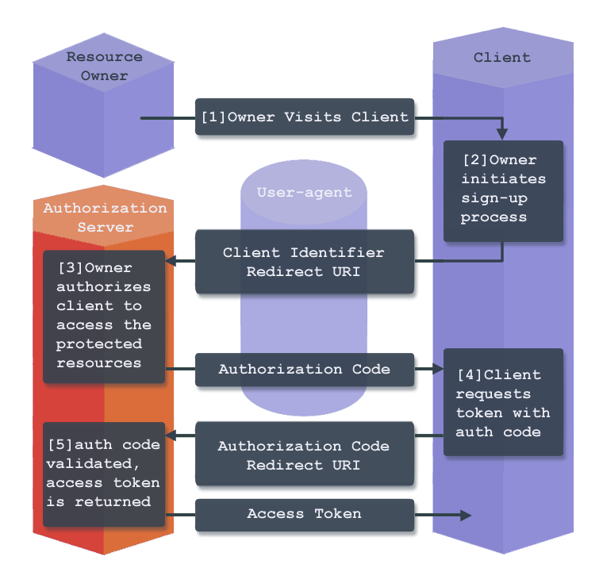

## What is iridium?
Iridium is an OAuth2.x-compliant identity management system.

## What problem does it solve?
The OAuth2.x RFC is full of great details, but it mainly focuses on defining the interfaces on how different identity systems can work together.  There are many implementation details in the spec which are not defined on purpose, which requires developers to make the best guess at how security, authentication, authorization, etc should be implemented within their own system.  The goal of the OAuth framework isn’t meant to restrict how implementation should be done, but to allow neighboring systems to be able to exchange data with one another securely.

Iridium helps developers secure their applications or systems the right way by providing an opinionated implementation on how to solve identity management for systems of any size.

## What do you mean there are many implementation details not defined?
Study the diagram below that describes how the authorization code grant works, but before you do let’s briefly call out what some of these terms mean.  

 *  **Resource owner:** The entity that can grant access to a protected resource.  An example is the end-user of an application.  
 * **User-agent:** any software that helps retrieve, present, and interact with web content.  An example is a web browser  
 * **Client:** A client is a third-party application that requests access to resources of the resource owner. An example is an Angular or React application.  
 * **Authorization server:** validates the credentials and redirects the resource owner back to the client with an authorization code.

  1. The resource owner (end-user) visits a third-party client (web application)  
2. The resource owner selects the “sign up with Google” button in the client. The user-agent (browser) directs the resource owner to the Google sign-in page.  
3. The resource owner (end-user) authenticates and authorizes the authorization server to grant access to the resource owner's information (in this case it could be the email address and profile information) to the third-party client.  
4. After the resource owner (end-user) authorizes access, the authorization server redirects the user-agent (browser) back to the original third-party client with an authorization code and typically a state parameter  
5. The third-party client requests an access token with the received authorization code and associated redirect URI  
6. The authorization authenticates the client, validates the authorization code and the accompanying redirect URI matches the URI provided in step D.  If the request is valid the authorization server returns back with an access token and an optional refresh token.  
The OAuth 2.x does a great job of giving an overview of how a system is expected to behave under certain circumstances, but it doesn’t tell you how to make the system make decisions behind the scenes to create the expected behaviors.  

## How does the system architected?
Iridium has been built with simplicity in the front of our minds as we build as flexible a model as we can. Iridium is served from a single jar tied to a relational database. 
The system expects specific seed data to exist in the database to allow for the system to successfully authenticate, authorize, and provision access tokens to your users.

## Tell me more about the code structure
We will get to this soon.
