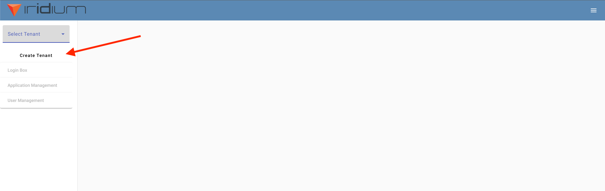
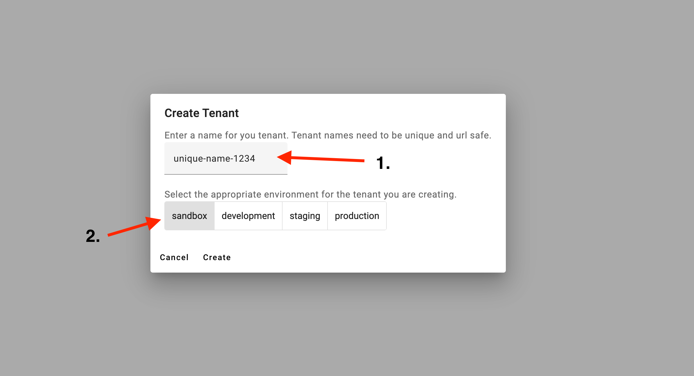
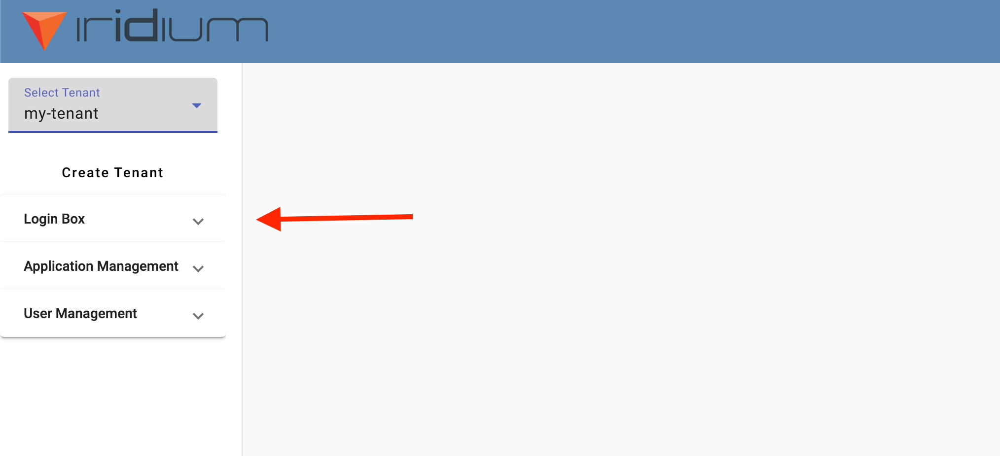
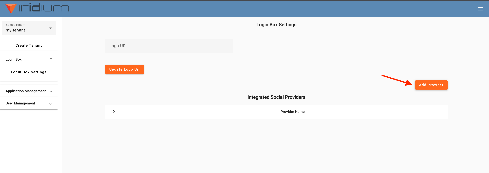
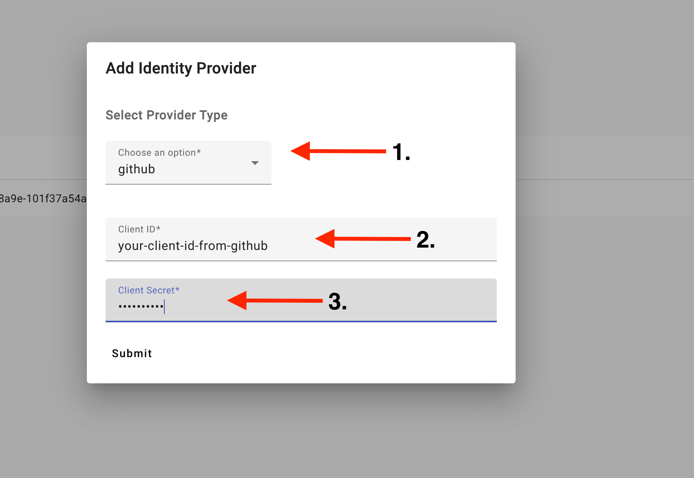
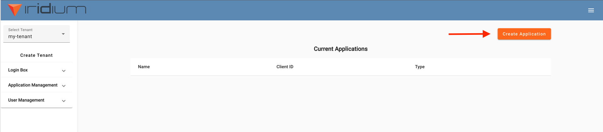
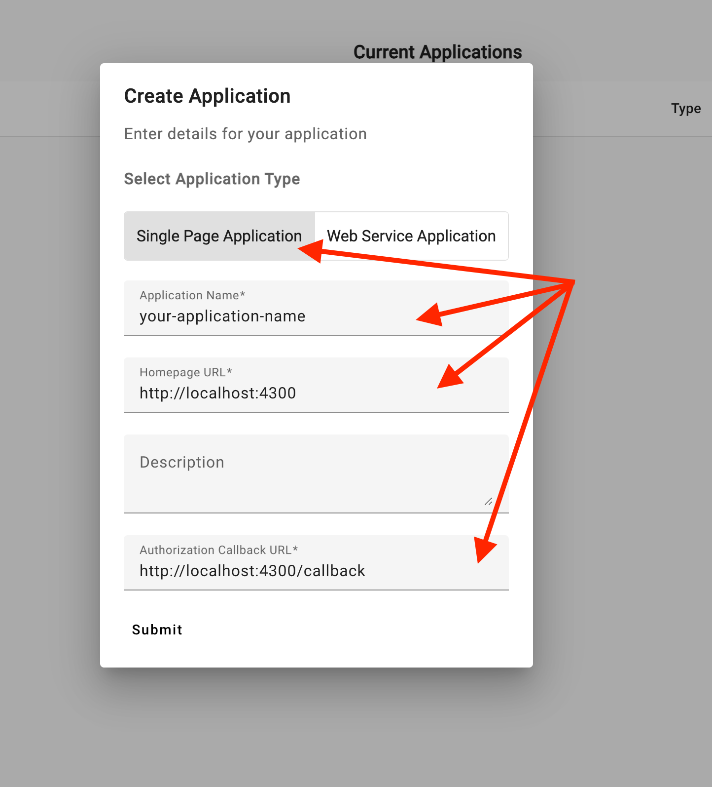
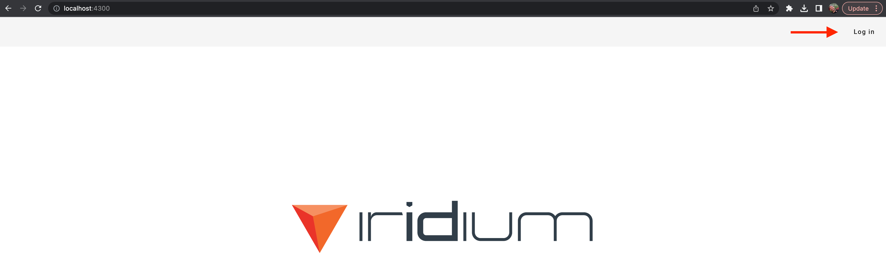
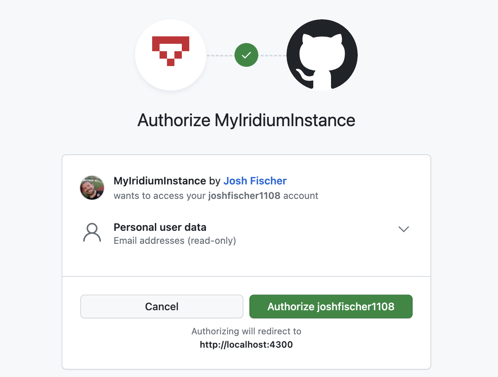
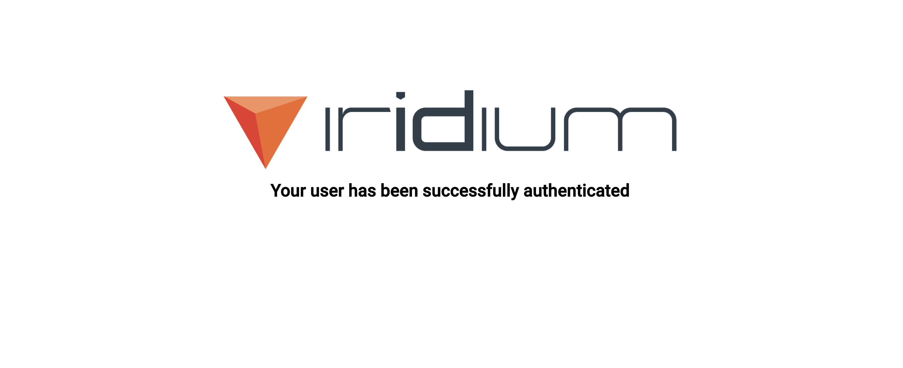

# Quickstart with Angular

This quickstart will show you how to secure an Angular application using Iridium.  
First, you’ll need to navigate to [https://conduct.iridium.software](https://conduct.iridium.software) to log in to the Iridium management UI.  
You can choose GitHub or Google as your preferred provider.
After authorizing the application you’ll be redirected back to the Iridium UI.

From here, select the “Create Tenant” button.



When the modal appears you’ll need to enter a tenant name that is unique within the system and URL friendly.  
This will be the subdomain value specific to your securing your users.
For example, if the tenant name you choose is “my-tenant” then your users will be
directed to my-tenant.iridium.software to be logged in.

For environment, you can select “sandbox”.



Next, set up your login box.



We will configure the box to allow your users to use GitHub to log in to your application.  
Select the “Add Provider” box to open the modal.



For the provider select “GitHub”. Fill out the fields with your GitHub application credentials



Next, we need to register your application for use within your tenant.
Select “Application Management” from the side menu.


Select “Create Application”



Add the following values to the modal that pops up.



After the application is created, make sure to save the client ID for future reference.


Next, clone the Iridium Angular starter application and `cd` into the folder.

```
$ git clone git@github.com:IridiumIdentity/iridium-angular-example.git
$ cd /iridium-angular-example
```

Open the environment.ts file for editing

```
$  vim src/app/environments/environment.ts
```

The environment.ts file should look like this:

```
export const environment = {
  production: false,
  iridium: {
    domain: 'https://ENTER_YOUR_TENANT_NAME_HERE.iridium.software/',
    redirectUri: 'http://localhost:4300/callback',
    clientId: 'ENTER_YOUR_CLIENT_ID_HERE',
    errorPath: '/error'
  }
};
~
```

- Replace “ENTER_YOUR_TENANT_NAME_HERE” with the tenant name you created earlier
- Replace “ENTER_YOUR_CLIENT_ID_HERE” with the application id generated earlier

Run your application

```
npm install && ng serve
```

Navigate to `localhost:4300`, select login in the top menu bar.



You should be redirected to your personalized login domain. Select “Login With GitHub”


You’ll be redirected to GitHub. The view should show details specific to the application you registered with GitHub.



(If you ever want to revoke the gitHub authorization, refer to [this](./revoking-github-authorization.md) documentation)

Select “Authorize ${your-github-name}” and you should be redirected back to your angular application with confirmation of successful authorization.



Congratulations, you have successfully registered and secured an application with Iridium!  
This project is still in its early stages, we’d like you to join us.  
If you have any comments, questions, or concerns (maybe a new framework client built for you) join the
community in GitHub discussions here: [https://github.com/orgs/IridiumIdentity/discussions](https://github.com/orgs/IridiumIdentity/discussions).
