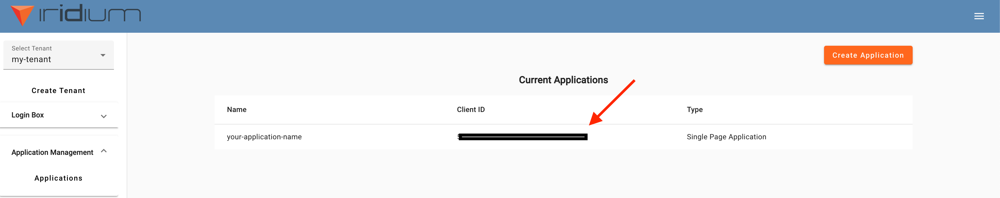
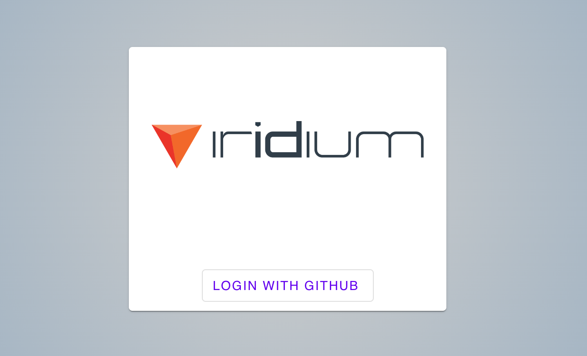

# Quickstart with Next.js

This document assumes you have already created a tenant and configured your login box with Iridium.

First, we need to register your Next.js application with in Iridium.

Select “Application Management” from the side menu.


Select “Create Application”


Add the following values to the modal that pops up.

* Application Type: `Single Page Application`
* Application Name: `${YOUR_APPLICATION_NAME}`
* Homepage URL: `http://localhost:3000`
* Authorization Callback URL: `ttp://localhost:3000/callback`

After the application is created, make sure to save the client ID for future reference.



Next, clone the Iridium Next.js starter application and `cd` into the folder.

```
$ git clone https://github.com/IridiumIdentity/iridium-nextjs-example
$ cd /iridium-nextjs-example
```

Create the environment file for Next.js to read your Iridium properties from. 

```
$  touch .env.local
```

Open the file with a text editor of your choice and enter the below as the contents.

```
NEXT_PUBLIC_IRIDIUM_DOMAIN=https://ENTER_YOUR_TENANT_NAME_HERE.iridium.software/
NEXT_PUBLIC_IRIDIUM_REDIRECT_URI=http://localhost:3000/callback
NEXT_PUBLIC_IRIDIUM_CLIENT_ID=ENTER_YOUR_CLIENT_ID_HERE
```


- Replace “ENTER_YOUR_TENANT_NAME_HERE” with the tenant name you created earlier
- Replace “ENTER_YOUR_CLIENT_ID_HERE” with the application id generated earlier

Run your application

```
$ npm install && npm run dev
```

Navigate to `localhost:3000`, select login in the right of the screen


You should be redirected to your personalized login domain. Select “Login With GitHub”



You’ll be redirected to GitHub. The view should show details specific to the application you registered with GitHub.


(If you ever want to revoke the gitHub authorization, refer to [this](./revoking-github-authorization.md) documentation)

Select “Authorize ${your-github-name}” and you should be redirected back to your Next.js application with confirmation of successful authorization.


Congratulations, you have successfully registered and secured a Next.js application with Iridium!  

This project is still in its early stages, we’d like you to join us.    

If you have any comments, questions, or concerns (maybe a new framework client built for you) join the community:   
* [GitHub Discussions](https://github.com/orgs/IridiumIdentity/discussions).
* [Discord](https://discord.gg/2TMwHF2TrS).
