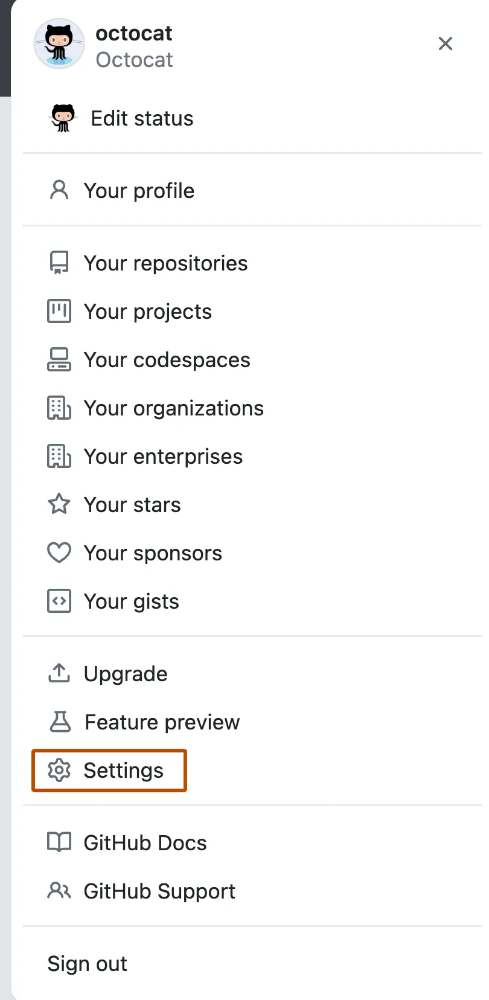
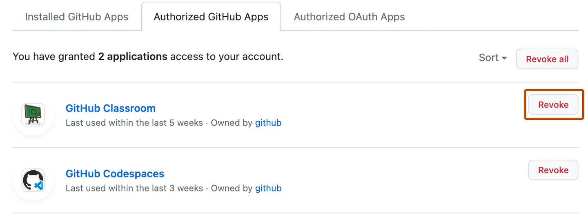

**Below outline the steps required to revoke the Iridium app from GitHub**

1. Log into you Github Account
2. Click on the settings icon on the sidebar
3. Search and click on the **_Applications_** settings under the **_Integrations_** section

   

4. Find your Iridium application and click on the corresponding configure button
   (You might be asked to enter the password at this point to authenticate the user)
5. Find the **_Uninstall_** button in the **_Danger Zone_** section of the settings

   

For further help, refer to the official [GitHub documentation](https://docs.github.com/en/apps/using-github-apps/reviewing-and-revoking-authorization-of-github-apps)
