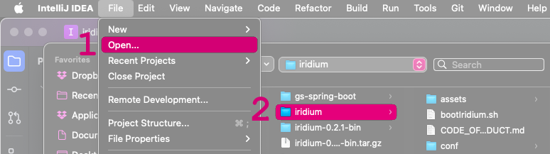
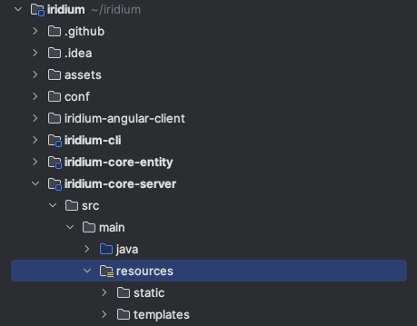

# Developing with an IDE

### Prerequisites

You will need:
 -  [Node 18](https://nodejs.org/en)
 -  [Java 17](https://adoptium.net/)  
 -  [Maven 3.8.4](https://maven.apache.org/) or greater  

---

Before you begin, make sure to [clone the repository](../4.run-iridium-with-docker.md). 

```shell
$ git clone git@github.com:IridiumIdentity/iridium.git
```
`cd` into the root folder.
```shell
$ cd iridium
```
If you have not already, [compile from source](../building-from-source.md). 

```shell
$ mvn clean package
```

When Maven has finished successfully, you will see the following.
```
[INFO] -----------------------------------------------------------------------
[INFO] BUILD SUCCESS
[INFO] ------------------------------------------------------------------------
[INFO] Total time:  01:08 min
[INFO] Finished at: 2023-09-11T12:54:42-07:00
[INFO] -----------------------------------------------------------------------
```


## Intellij

### **Open the project**

### Use CLI

**Current supported operating systems**
* darwin (OSX):
From the `iridium` folder you can open the project in Intellij.
```shell
$ ./tools/scripts/setup-intellij.sh
```
### Use Intellij GUI
In the menu bar in Intellij go to  `File -> Open...` then select the top level folder of the iridium project on your computer. The project will be named `Iridium`.



Iridium is a standard Maven project and should import without additional requirements.


---
### **Copy application.properties**
In an IDE, Springboot will not find the `application.properties` file in its default directory. To start Iridium on your IDE, copy the file to a recognized location.

### Use CLI
To successfully start Iridium on your IDE, run the following command from the top of the `iridium` directory. 
```shell
$ cp ./conf/application.properties ./iridium-core-server/src/main/resources
```
 *Any changes you make to `application.properties` will need to be updated on both files.*

### Use Intellij GUI
Initial location of the `application.properties` file:


where to paste the file:




**You are now ready to run Iridium from your IDE.**

