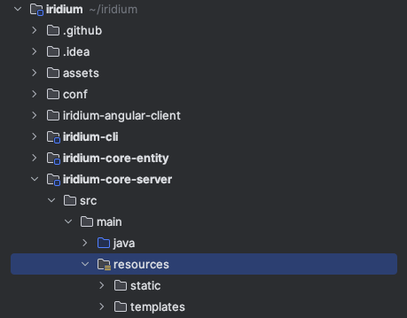

# Developing with an IDE

### Prerequisites

You will need:
 -  [Node 18](https://nodejs.org/en)
 -  [Java 17](https://adoptium.net/)  
 -  [Maven 3.8.4](https://maven.apache.org/) or greater  
---
Known compatible IDEs:
- Intellij
- Visual Studio Code
- Spring Tools Suite
---

Clone the repository.

```shell
$ git clone git@github.com:IridiumIdentity/iridium.git
```
`cd` into the root folder.
```shell
$ cd iridium
```
If you have not already, [compile from source](./building-from-source.md). 

```shell
$ mvn clean package
```

When Maven has finished successfully, you will see the following.
```
[INFO] -----------------------------------------------------------------------
[INFO] BUILD SUCCESS
[INFO] ------------------------------------------------------------------------
[INFO] Total time:  01:08 min
[INFO] Finished at: 2023-09-11T12:54:42-07:00
[INFO] -----------------------------------------------------------------------
```

## Setting up

### Use launcher script
#### Current supported operating systems
* darwin (OSX)
From the root folder of the repo you can execute the following command to open the project in Intellij.
```shell
$ ./tools/scripts/setup-intellij.sh
```
### Use Intellij GUI
Iridium is a standard Maven project. Simply go to  
`File -> Open...` then select the top level folder of the iridium project on your computer.


---
## Copy application.properties
In an IDE, Springboot will not find the `application.properties` file in its default directory. To start Iridium on your IDE, copy the file to a recognized location.

### Use CLI
To successfully start Iridium on your IDE, run the following command from the top of the `iridium` directory. 
```shell
$ cp ./conf/core-application.properties ./iridium-core-server/src/main/resources
```
 *Any changes you make to `application.properties` will need to be updated on both files.*

### Use Intellij GUI
Initial location of the `application.properties` file:


where to paste the file:



---
## Run Iridium

Iridium requires `Springboot` to run on an IDE. If you do not have Springboot in your IDE, download an extension or plugin that adds it as a run configuration.

To run Iridium on your IDE, you will need to run from `Iridium.java`. This can be found in the `iridium-core-server` directory:


Certain IDEs use different run configurations. If you are having trouble starting Iridium, see below.

- **Intellij:** If Intellij does not automatically recognize as a springboot application, then run as a springboot application.
- **Visual Studio Code:** Run as a java application.
- **Spring Tools Suite/Eclipse:** Run as a springboot application. Ensure your preferred openJDK instance is not in conflict with the IDE's inbuilt version.


