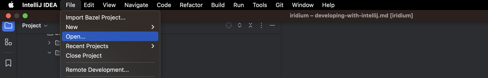

## Setting up with Intellij

### Use launcher script
#### Current supported operating systems
* darwin (OSX)
From the root folder of the repo you can execute the following command to open the project in Intellij.
```shell
$ ./tools/scripts/setup-intellij.sh
```
### Use Intellij GUI
Opening Iridium with Intellij is straight-forward.  In the menu bar in Intellij go to  
`File -> Open...` then select the top level folder of the iridium project on your computer.



The project should load as it's a standard Maven project. 


